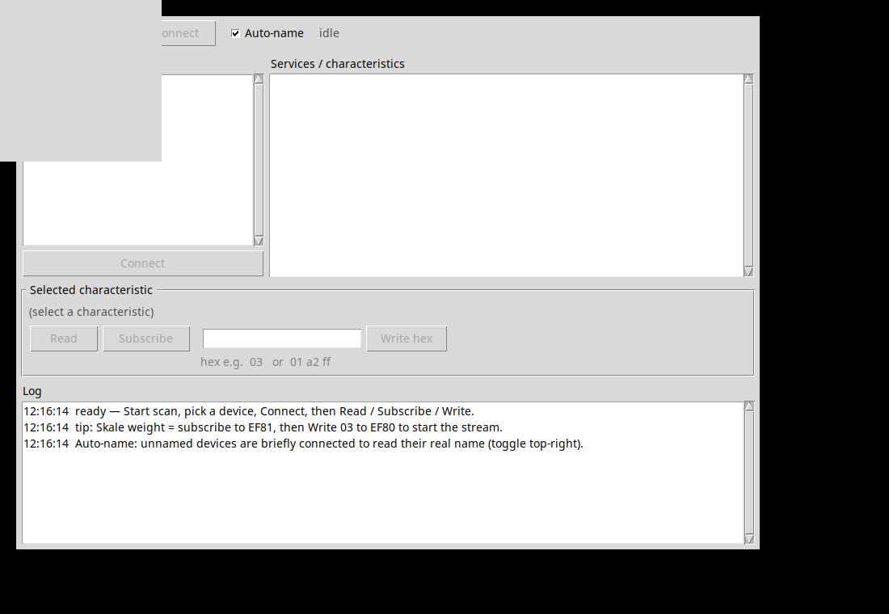

# blz_ble_shim

**Run AndroWish / Android Bluetooth-LE Tcl code, unaltered, on Linux/BlueZ.**

`blz_ble_shim` installs an [AndroWish](https://www.androwish.org/)-compatible
`ble` command implemented on top of undroidwish's built-in `blz` (BlueZ)
command. Tcl programs written against AndroWish's `ble` API — for example the
[Decent Espresso `de1app`](https://github.com/decentespresso/de1app) — then run
on desktop/embedded Linux with **no code changes**, save one line:

```tcl
package require blz_ble_shim
```

It ships with a **simulator** (`blz_sim`) backed by virtual DE1 + Skale devices,
so you can develop and test AndroWish BLE apps on any platform — **including
macOS — with no Bluetooth hardware at all.**

---

## Why

AndroWish (Android) provides a rich `ble` command. undroidwish on Linux instead
provides `blz`, a *different* BlueZ-backed command. The two speak the same
concepts but different verbs and event shapes, so AndroWish BLE apps don't run
as-is on Linux. This package bridges that gap: it presents the exact AndroWish
`ble` surface and translates every call/event to/from `blz`.

```
your AndroWish app ──ble …──▶ blz_ble_shim ──blz …──▶ BlueZ (bluetoothd)
        (unchanged)          (this package)          (undroidwish on Linux)
```

## How it works

`blz` emits only three callbacks (scan, connection, notification) and its
`read`/`write` are **synchronous with no event**. AndroWish apps, however,
sequence on events `blz` never sends — the write-with-response ACK
(`characteristic access=w`), the read-completion (`access=r`), the per-service
discovery stream (`characteristic state=discovery`), and the notification-enable
acknowledgement (`descriptor access=w`). The shim **synthesizes** those, delivered
asynchronously (via `after 0`) so ordering matches Android. It also:

- allocates one `blz` context per connection (plus one for scanning) and routes
  events to the right handle;
- resolves each scanned device's **name from its raw advertising data**;
- turns `blz`'s pull-style discovery (`blz services` / `blz characteristics`)
  into AndroWish's push-style discovery events;
- fabricates the `sinstance` / `cinstance` integers AndroWish apps record and
  echo back.

## Install

Pick either form — both make `package require blz_ble_shim` work.

**A. Installer**

```sh
./install.sh            # -> /usr/local/lib   (works for tclsh/wish/undroidwish; may need sudo)
./install.sh --user     # -> ~/Library/Tcl    (macOS, no sudo)
./install.sh /my/libdir # -> a directory of your choice
```

**B. By hand** — copy `pkgIndex.tcl`, `blz_ble_shim.tcl`, and `blz_sim.tcl` into
a `blz_ble_shim/` directory on Tcl's `auto_path` (`/usr/local/lib`,
`~/Library/Tcl`, `/Library/Tcl`, …), or point `TCLLIBPATH` at wherever you put
them. Cloning this repo and putting the clone on `auto_path` also works — the
repo root is a valid package directory.

**C. Single-file Tcl Module** — copy `blz_ble_shim.tcl` to a directory on
`tcl::tm::path` renamed `blz_ble_shim-1.0.tm` (e.g. `~/Library/Tcl/tcl8/8.6/`).

## Use

```tcl
package require blz_ble_shim
```

On undroidwish/Linux this installs the `ble` command over the real `blz`. The
shim is safe everywhere:

- if a **real `ble`** already exists (Android; macOS CoreBluetooth), it defers
  and does not override it;
- if **`blz` is absent** (not undroidwish-on-Linux), it stays inert;
- it also does `package provide ble 1.0`, so an app's own `package require ble`
  is satisfied.

Override the BlueZ adapter with the environment variable `BLZ_ADAPTER=hciN`
(default `hci0`).

## Test with no hardware (any platform, incl. macOS)

The companion `blz_sim` package is a simulated `blz` backed by virtual DE1 and
Skale peripherals that advertise, discover, ACK writes, react to writes
(a `RequestedState` write drives a `StateInfo` notification), and stream weight
notifications in the real 18-byte Atomax format.

```tcl
package require blz_sim          ;# simulated blz + virtual devices
package require blz_ble_shim     ;# `ble` on top of the simulator
```

Run the bundled examples:

```sh
tclsh examples/scan.tcl --sim               # list the virtual devices
wish8.6 examples/run_bledemo_sim.tcl        # full GUI BLE debugger, no radio
```

`examples/bledemo.tcl` is a LightBlue-style BLE debugger (scan → connect →
browse services → read / subscribe / write). It is an unmodified AndroWish app —
proof that the shim runs real apps as-is.



## Tests

```sh
tclsh test/selftest_mock.tcl     # 32 unit checks: event synthesis, ordering, adv-name parsing
tclsh test/test_shim_e2e.tcl     # 27 end-to-end checks over the simulated DE1 + Skale
```

The end-to-end suite exercises the full app flow: scan → name-resolve → connect
→ discovery → enable/notify → **write-ACK-gated writes** → read → concurrent
DE1+Skale event routing → disconnect → UUID helpers.

## API

The `ble` command mirrors AndroWish. Your callback is invoked as
`{*}$callback $event $datadict`.

```
ble scanner   <cb>                              -> token; starts scanning
ble start     <token>                           -> (re)start scanning
ble stop      <token>                           -> stop scanning
ble connect   <address> <cb> ?<reconnect>?      -> connection handle "ble<n>"
ble reconnect <handle>                          -> re-attempt connect
ble close     <handle>                          -> disconnect (or stop a scanner)
ble disconnect <handle>
ble info      ?<handle>?                         -> handles / info dict
ble enable    <h> <suuid> <si> <cuuid> <ci>     -> 1  (enable notifications)
ble disable   <h> <suuid> <si> <cuuid> <ci>     -> 1
ble write     <h> <suuid> <si> <cuuid> <ci> ?<writetype>? <data>  -> 1
ble read      <h> <suuid> <si> <cuuid> <ci>     -> 1
ble mtu       <h> ?<value>?                      -> negotiated MTU
ble userdata  <h> ?<value>?                      -> per-handle scratch store
ble state                                        -> adapter state
ble expand / shorten / equal  ...                -> UUID helpers
```

| `event` | key fields in `datadict` |
|---------|--------------------------|
| `scan` | `address` `name` `rssi` (`services` `mfr` when advertised) |
| `connection` | `handle` `address` `state` (`connected`/`disconnected`), `mtu` |
| `characteristic` (`state=discovery`) | `suuid` `sinstance` `cuuid` `cinstance` |
| `characteristic` (`state=connected`) | `access` (`r`/`w`/`c`), `value` (binary), `cuuid` … |
| `descriptor` (`state=connected access=w`) | notification-enable (CCCD) acknowledgement |

## Limitations

`blz` (BlueZ) is a smaller surface than Android's GATT layer, so a few AndroWish
features are approximated or unavailable — none of which affect typical
central-role apps (DE1, scales, sensors):

- **Pairing/bonding** — BlueZ pairs via its own agent; `pair`/`unpair` are no-ops
  here (fine for Just-Works / unencrypted peripherals).
- **Arbitrary descriptor I/O** — only the CCCD (notifications) is exposed;
  `dread`/`dwrite` of other descriptors aren't available.
- **Reliable-write transactions** (`begin`/`execute`) are passed through, not
  atomic.
- **MTU** is reported as a fixed default (BlueZ negotiates it in-kernel anyway).
- **Duplicate-UUID disambiguation** — `sinstance`/`cinstance` are constants (real
  devices with unique UUIDs are unaffected).

The write-with-response ACK is synthesized after `blz write` returns; on rare
back-to-back-ack-gated flows (e.g. firmware upload) validate timing on real
hardware.

## Building the real `blz` (Linux)

undroidwish's prebuilt binaries do **not** bundle `blz`; it lives in the
AndroWish source tree and must be compiled. `docs/BUILDING_BLZ.md` has a
step-by-step recipe (deps, the AndroWish-vendored `blzlib`, the `-lsystemd
-lbluetooth` link) that produces a loadable `blz` extension for your platform.

## License

[Tcl/Tk license](LICENSE) (BSD-style). Copyright © 2026 John Buckman.

Built to bring AndroWish Bluetooth apps — like the Decent Espresso `de1app` — to
Linux; usable by any Tcl program that wants the AndroWish `ble` API on BlueZ.
